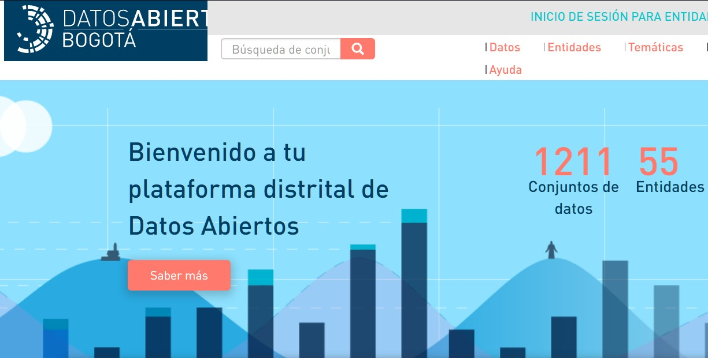
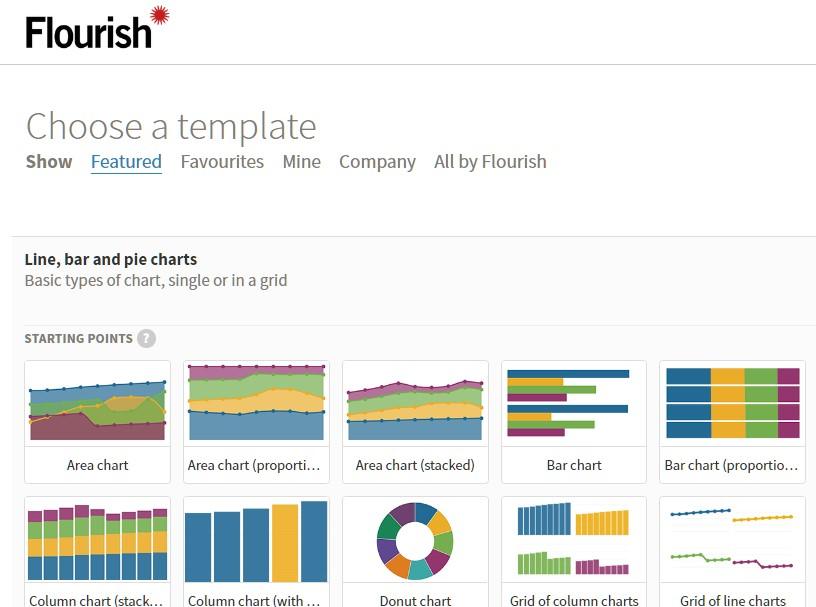
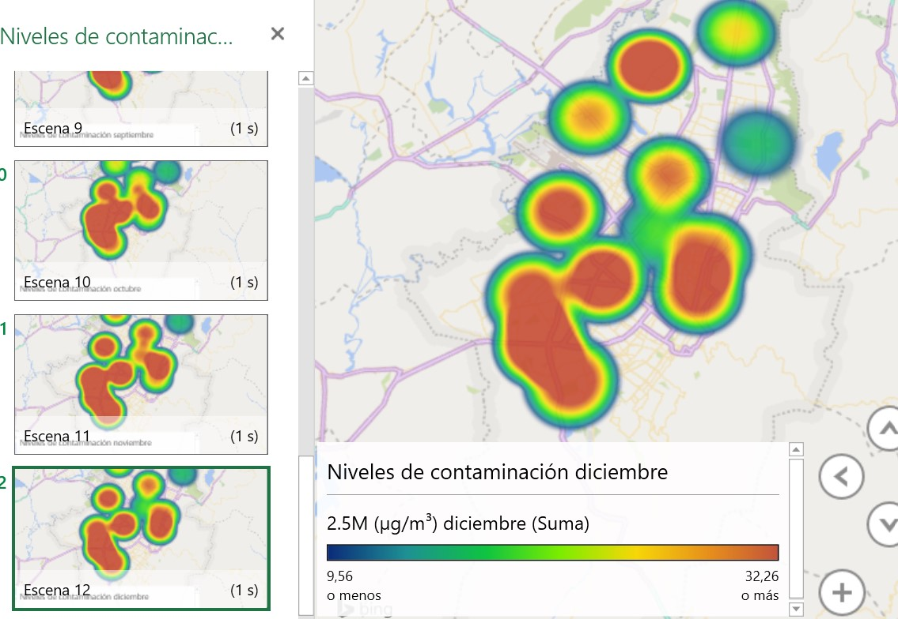

# Proyecto - Computación Visual
## Universidad Nacional de Colombia

## NIVELES DE CONTAMINACIÓN EN BOGOTÁ EN EL AÑO 2019
### Presencia de partículas tipo PM2.5 en las diferentes estaciones de la ciudad

#### David Styven Nieto Marin - dsnietom@unal.edu.co - dsnietom
#### Luis Gerson Avendaño Alvira - lgavendanoa@unal.edu.co - baskecho
#### Steven Espinosa Martinez - stespinosama@unal.edu.co - stespinosama

## 2. Visualización de información

### 2.1. MOTIVACIÓN
El proyecto propuesto  para el módulo de visualización de la información se realizó con el fin de practicar y ampliar los conocimientos adquiridos en el curso de **Computación Visual** impartido por el profesor *Jean Pierre Charalambos Hernández*, adicional a eso, se realizó investigación que agregó valor a lo aprendido al ayudar y mejorar las destrezas en el desarrollo de aplicaciones con un alto enfoque visual.

La visualización de datos es un proceso de interpretación, búsqueda, análisis y estudios que permite 
obtener resultados frente a una problemática; en este caso hemos dado uso a los datos abiertos de la ciudad de Bogotá, los cuales están representados en tablas de excel, json, csv entre otros. Estos datos está expuestos a todo el mundo y son actualizados con frecuencia.

Como motivación trabajamos y análisamos los dados enfocados a la contaminación en Bogotá, con el fin de trasnformar estos datos en gráficas y mapas que nos permiten facilitar la vista de estos datos y poder mostrarlos como información correcta y apropiada para las personas del común.

### 2.2. OBJETIVOS
1.Implementar el proyecto propuesto para la visualización de información relacionada con los niveles de contaminación de la ciudad de Bogotá. &nbsp;

2.Manipular información de otras fuentes con el propósito de transformarla para ser interpretada por otro usuario por medio de una página web. &nbsp;

3.Exponer y demostrar las habilidades adquiridas en la asignatura y otras habilidades de autoaprendizaje.

4.Fortalecer habilidades para el trabajo en equipo, manejo de herramientas conjuntas y autoaprendizaje.

5.Implementar el desarrollo de herramientas que permiten manejar y procesar datos

### 2.3. METODOLOGÍA

1Hemos decidido usar los datos abiertos de la ciudad de Bogotá (https://datosabiertos.bogota.gov.co) para obtener información acerca de la presencia de partículas contaminantes en el aire de nuestra ciudad.

La búsqueda nos llevó a encontrar datos acerca de **La ubicación de las estaciones que miden la calidad del aire** y una colección de datos sobre **La presencia de partículas PM2.5 en cada estación durante el año 2019**.

### 2.4. RESULTADOS

### 2.5. CONCLUSIONES

### 2.6. TRABAJO DE INDAGACIÓN FUTURO SUSCITADO
